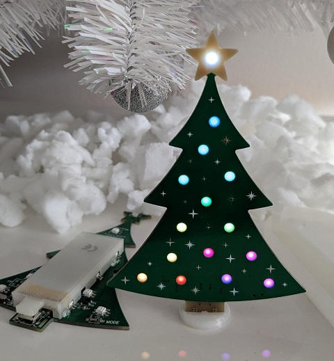

# NeoTree

## Features
- Christmas-Tree style PCB
- 15 NeoPixel RGB LEDs (SK6812) shining through the PCB
- Powered by rechargeable LiPo Battery
- Charged via MicroUSB (2h full charge)
- Custom programming via MicroUSB
- Based on ATTiny85 microcontroller
- Mode/Animation selection via Button

A **short press** on the MODE button cycles the available modes. When you **hold down** the MODE button, the current animations slows down or changes its style each time the star flashes.
## Getting started (programming)

### Installing VSCode and PlatformIO
Install [VSCode](https://code.visualstudio.com/) and open the downloaded/cloned [project folder](https://github.com/xsrf/NeoTree/archive/refs/heads/master.zip) in VScode.
VSCode should ask you to install the PlatformIO extension - do so.
You may need to close VSCode and open the folder once again in VSCode for PlatformIO to recognize the project.
Open `src/main.c` and look for "Build", "Upload", "Home" buttons on the bottom bar of VSCode.

### Installing Zadig (Windows)
Download Zadig from [here](https://zadig.akeo.ie/) or [github releases](https://github.com/pbatard/libwdi/releases). 
Zadig is used to install the required USB driver. See the [documentation](https://github.com/pbatard/libwdi/wiki/Zadig) for more details and screenshots.
Assign the `libusb-win32` driver (not `winusb`).

To do so, the NeoTree needs to be pre-flashed with the USB bootloader (see *usb-bootloader* subfolder), turned off, connected via MicroUSB cable and then turned on. It should appear in Zadig. Select "Options - List All Devices" if it doesn't. Select `libusb-win32` and click install.

### Compile and upload code
Open the project folder in VSCode and open `src/main.c`. Make sure to select `env:usb` in the bottom bar of VSCode as PlatformIO environment.
Connect the NeoTree via USB but keep it turned off.
Then hit upload ("->" Button) and follow the console output.
When it says `Please plug in the device (will time out in 60 seconds) ...` turn on the NeoTree. It should immediately upload the new code.